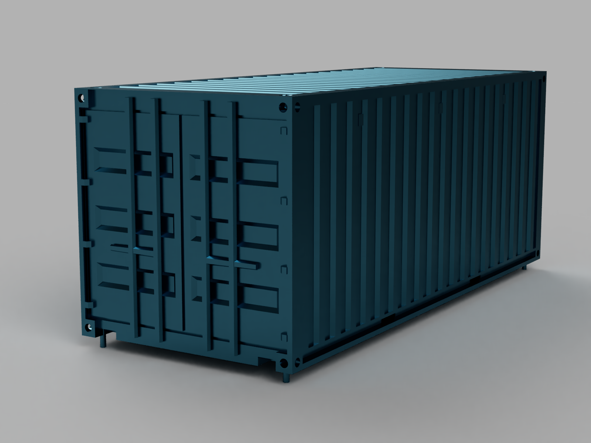

**The project is a proprietary implementation of the STL library.**

* The code is written according to google style
* All classes are template-based
* The library implements structures such as:
  + List
  + Map
  + Set
  + Queue
  + Stack
  + Vector
  + Array
  + Multiset
  
***

This project was developed by a students of School 21: tszechwa, xerminia, ptyrande, iseadra
